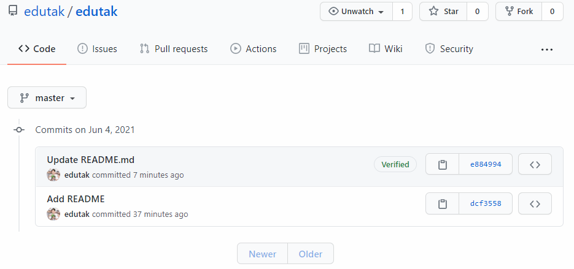
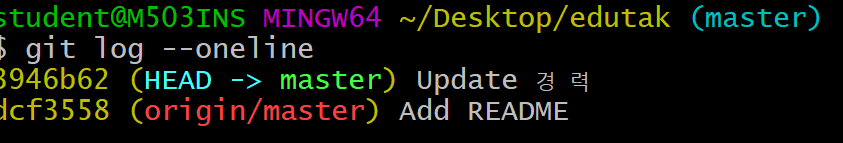

# push error


```
$ git push origin master
To https://github.com/edutak/edutak.git
 ! [rejected]        master -> master (fetch first)
 # 에러!!!
error: failed to push some refs to 'https://github.com/edutak/edutak.git'
# Updates이 거절되었다. 
# 원격저장소 작업이 로컬에 가지고 있지 않아...
hint: Updates were rejected because the remote contains work that you do
hint: not have locally. This is usually caused by another repository pushing
# 너는 원격저장소 변경사항들을 먼저(first) 통합하는것을 원할거야....
# 다시 push 하기 전에....
hint: to the same ref. You may want to first integrate the remote changes
hint: (e.g., 'git pull ...') before pushing again.
hint: See the 'Note about fast-forwards' in 'git push --help' for details.
```

## 확인 해보기

> 원격저장소 커밋과 로컬 저장소 커밋 히스토리를 서로 비교

[](https://github.com/edutak/TIL/blob/master/git/md-images/image-20210604112736553.png)

[](https://github.com/edutak/TIL/blob/master/git/md-images/image-20210604112746050.png)

## 해결 방법

```
$ git pull origin master
# 아마 커밋이 발생할 것.
$ git log --oneline
# Merge 커밋 => 원격이랑, 로컬 다른 버전을 두개 합쳤다!
b7b72e1 (HEAD -> master) Merge branch 'master' of https://github.com/edutak/edutak 
3946b62 Update 경력
e884994 (origin/master) Update README.md
dcf3558 Add README
$ git push origin master
Enumerating objects: 10, done.
Counting objects: 100% (10/10), done.
Delta compression using up to 12 threads
Compressing objects: 100% (4/4), done.
Writing objects: 100% (6/6), 725 bytes | 725.00 KiB/s, done.
Total 6 (delta 1), reused 0 (delta 0), pack-reused 0
remote: Resolving deltas: 100% (1/1), done.
To https://github.com/edutak/edutak.git
   e884994..b7b72e1  master -> master
```