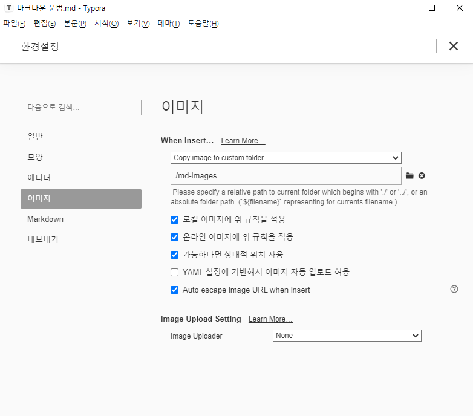

# 마크다운 문법 h1

## 제목(heading) h2

문서의 구조를 잡기 위해 활용된다. 제목의 레벨(1~6)에 맞춰 `#`(backtic, 숫자 1 왼쪽) 으로 표현한다.

### 제목3 h3

#### 제목4 h4

##### 제목5 h5

###### 제목6 h6


## 목록

* (*+spacebar) 순서가 없는 목록
* 순서가 없는 목록
  * (tap) 들여쓰기
  * 순서가 없는 목록
* (shift+tab) 밖으로 나가기
* (enter+enter) 나가기

1. 순서가 있는 목록
2. 순서가 있는 목록
   1. (tap) 들여쓰기
   2. 순서가 있는 목록
3. (shift+tab) 밖으로 나가기

> (> ) 인용문 

## 코드 블록

인라인 코드블록 `def`

(`) 3개 연속 입력

python 예시

```python
# 주석
print('hello')
def foo():
    return True
```

html 예시
```html
<!-- 주석 -->
<body>
</body>
```

| 순번 | 이름   | 비고 |
| ---- | ------ | ---- |
| 1    | 홍길동 |      |
| 2    | 김철수 |      |
| 3    | 박영희 |      |

(ctrl + /) 표가 어떤 문법인지 알 수 있음  


## 이미지

Typora 환경설정을 통해서 이미지를 상대 경로로 복사하여 관리할 수 있도록 설정




## 링크

[구글 링크](https://google.com)

[폴더](md-images/image-20210603144336935.png)에 마크다운에 활용된 이미지


## 기타

*기음임(이탤릭체)*
(* *)

**굵게(볼드체)**
(** **)

~~취소선~~
(~~ ~~)

---

(---)


